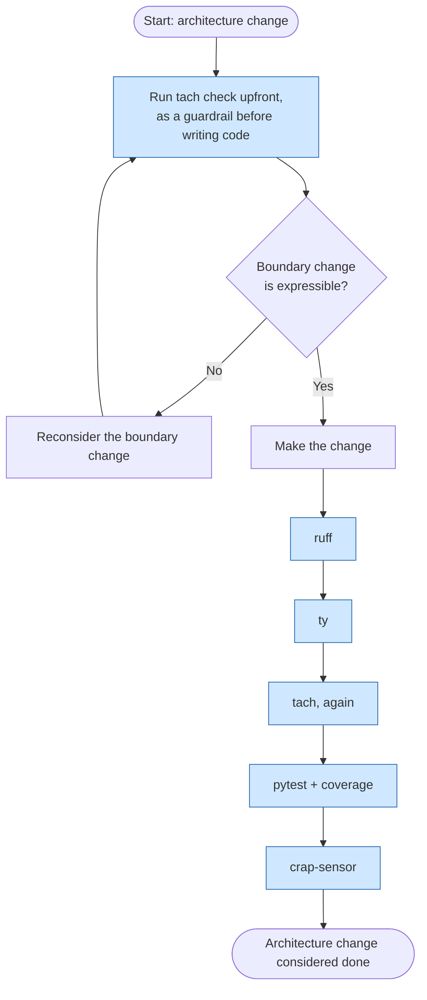

# Architecture change

This flow applies when changing module boundaries or layering itself —
for example adding a new top-level layer under `src/app/` or altering
which layers may depend on which. Unlike the other flows, the
computational sensor for structure (`tach check`) runs *before* any code
is written, as an upfront guardrail that confirms the intended boundary
change is actually expressible, rather than only as a final check.

