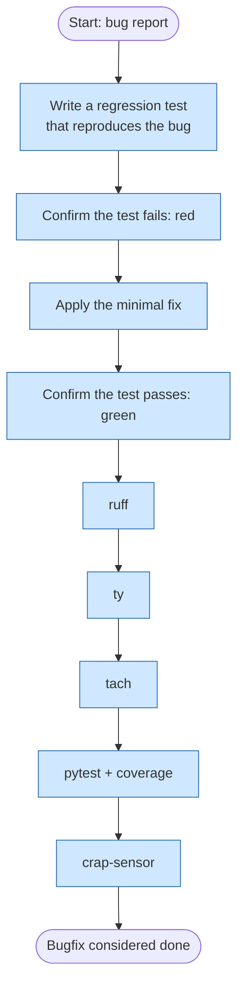

# Bugfix

This flow applies when fixing a defect in existing behavior. It starts by
proving the bug exists through a failing regression test, applies the
smallest change that makes it pass, and then confirms nothing else broke
by running the full computational sensor suite.

