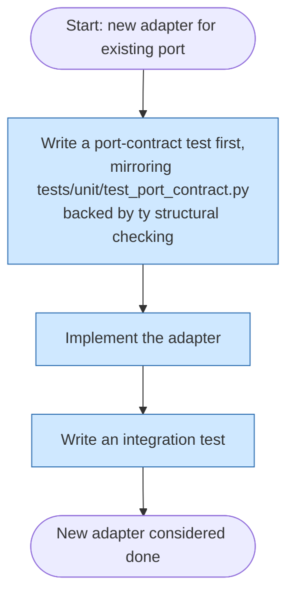

# New adapter

This flow applies when adding a new adapter implementation for an
existing port (gateway), for example a new persistence backend or a new
notification channel. The port-contract test comes first because it is
what proves the new adapter honors the same behavioral contract as every
other adapter of that port, mirroring the pattern already established in
`tests/unit/test_port_contract.py` and backed by `ty`'s structural
(`Protocol`) checking at the wiring boundary.

