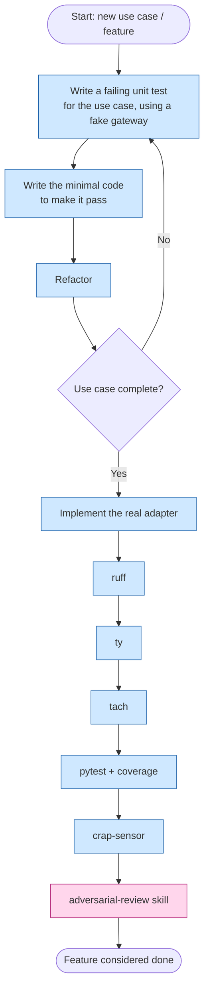

# New feature / new use case

This flow applies when implementing a brand-new use case or feature in
the domain layer — the most common change. It starts with a Three Laws
of TDD loop written against the use case in isolation (with a fake
gateway standing in for the real adapter), moves on to the real adapter
implementation once the use case is proven, and then closes with the
full computational sensor suite run cheapest-first, followed by the one
inferential step: the adversarial-review skill.

