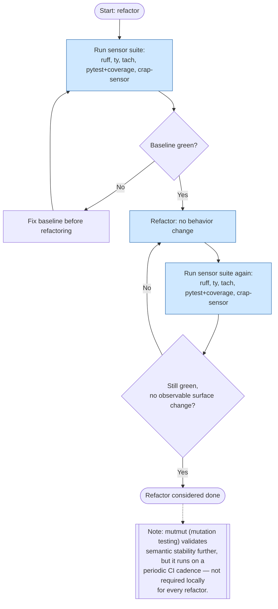

# Refactor

This flow applies when restructuring existing code without changing its
observable behavior. The sensor suite runs twice — once before, to
establish a green baseline, and once after, to prove nothing changed
behaviorally — and no new tests are required unless the refactor actually
changed the observable surface (in which case it is no longer a pure
refactor and the new-feature or bugfix flow applies instead).

